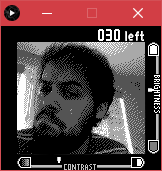
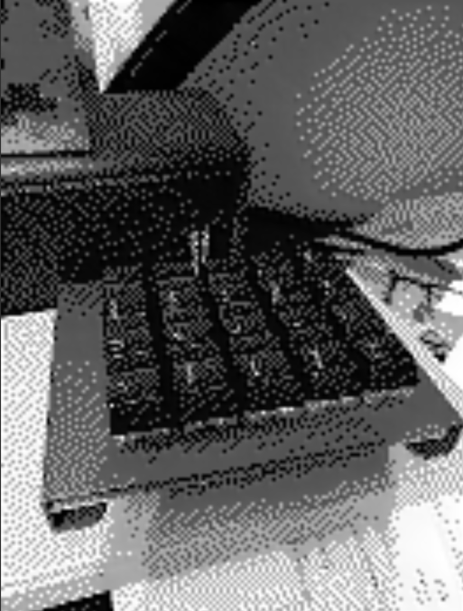
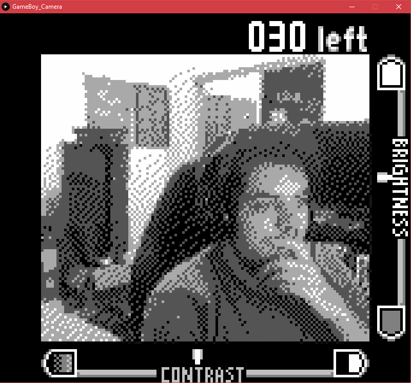

## Gameboy Camera Clone
A clone of the GameBoy Camera written in Processing  
  
This java (processing) app is built to replicate the effect of the GameBoy Camera's image system by quantizing and dithering the image.

Each part of the program is segmented as follows:
## GameBoy_Camera
holds basic units of the the program; Variables in the global scope, values such as how many pics are available to be taken and the screen ui objects, along with the vector that describes the size of the screen
Then it defines the draw function, which is looped every frame, designated to draw the UI, draw an image to the screen and load the framebuffer to 'do its magic'
## Camera
manages the camera subsystem and scales images to the proper screen size
## Effects
holds greyScale() designated to quantizing and dithering the image
holds brightnesscontscale() designated to applying a filter that changes the brightness and contrast by localized values
holds scale() which scales up the screen by a global value
## EventHandler
manages key input events for controlling the global brightness and contrast
## Helper
where I keep simple helper functions
## Init
holds settings() which properly scales size and scale of the program
holds setup() which starts up most of the background systems, manages global variables and initializes all UI objects
## UI
handles UI and UIObject classes which designate how UI objects are created and stored within one global instance of UI.

# How does the Gameboy filter work?

I implemented Floyd-Steinberg Dithering which you can see an example of (along with the tutorial I followed) here: https://www.youtube.com/watch?v=0L2n8Tg2FwI

You can see a video where I originally implemented this dithering method here: https://youtu.be/efzJUmbCNoI?t=8m

## System Design

Processing Java Core Targeted
works great on windows and mac, probably linux and can be compiled easily for any of them using the compiler built into processing. Just open the project using the processing ide, then go and export. Works best with a keyboard plugged in (to control the arrow keys

## Usage

In the current state of the app, the only controls are the arrow keys and X button to close.
Using the arrow keys adjusts the brightness and contrast based on the sliders on the bottom and right side of the screen.

## To Do- Functional Changes
main goal is to add a spacebar-capture feature that can save .png's for the images onscreen, but I only want to do that if I can get full functionality (sounds effects, classic confirmation etc.

before I do that I'm gonna aim to redefine how UI can be created so that more things can be inserted into UI (implementing polymorphism so that an image-storing UI isn't the only type of UI that can be displayed or dynamically allocated etc.)
